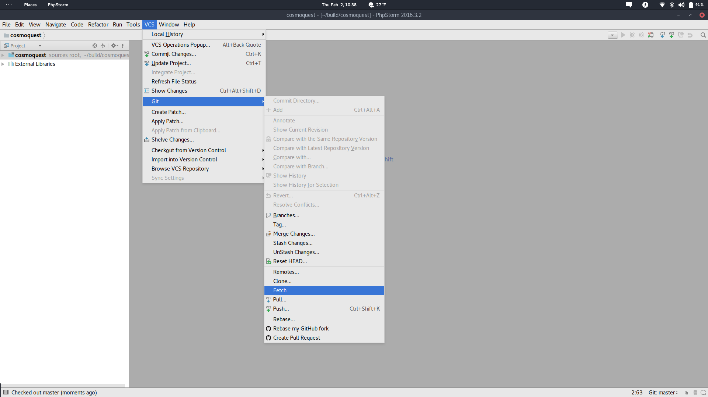
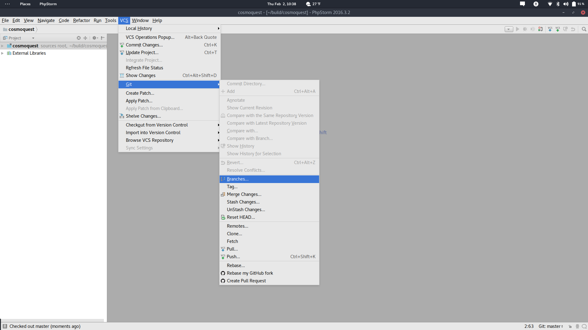
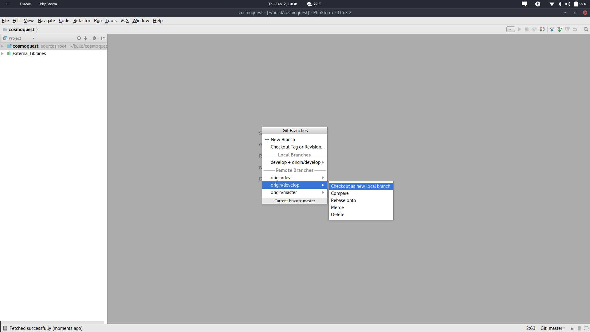
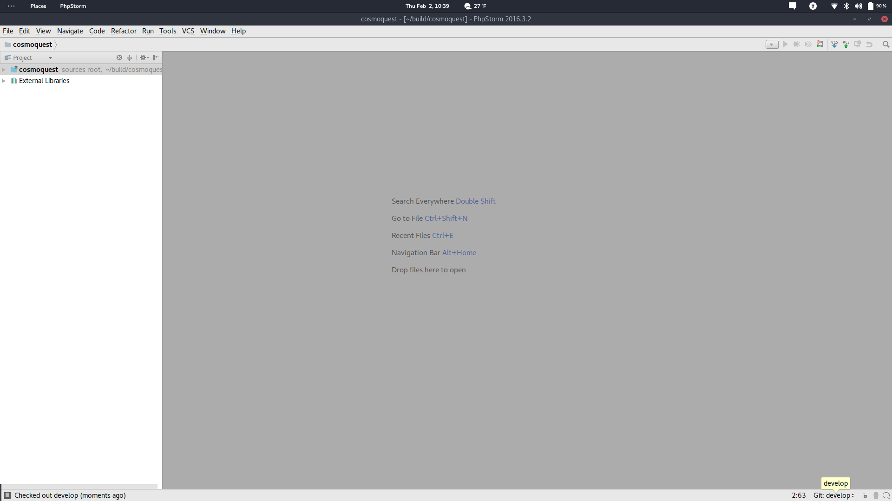

## Welcome to the CosmoQuest Github Wiki

This wiki contains instructions for accessing the CosmoQuest github repositories.

### Git Repositories

The two primary repositories are [cosmoquest](https://github.com/CosmoQuestTeam/cosmoquest) and [cosmoquest-wordpress](https://github.com/CosmoQuestTeam/cosmoquest-wordpress).  Both are currently only viewable via CosmoQuestTeam Github members.

### Branches

All repositories have both a _master_ and _develop_ branch.

The _develop_ branch is used as a staging area for the project.  Development of new code, both new features and long term bug fixes, should be placed in the _develop_ branch.  When code in the _develop_ branch is considered ready to be on the live server, a pull request  **must** be created so that the changes can be viewed and discussed with all development team members. For more information on creating pull requests on Github, please check the [Github Documentation](https://help.github.com/articles/creating-a-pull-request/).

The _master_ branch contains code that is running on the live site. Code **must** be considered stable and ready for production before it is pulled into the _master_ branch.

#### Live Fixes

In the event that live fixes are necessary, they are to be places in the _livefixes_ branch. This branch comes from the _master_ branch directly.  In order to effectively use the _livefixes_ branch we **must** follow the following procedure.

1. If the _livefixes_ branch **does not** already exist, create a new branch off of the _master_ branch. **Otherwise**, checkout the _livefixes_ branch and pull the latest version of _master_ onto it.
2. Push the changes from 1 onto Github (the origin/livefixes branch).
3. Make any changes that are necessary and commit them.
4. When all changes are made, push them to the _livefixes_ branch.
5. Issue a pull request to add the fixes to the _master_ branch.
6. **If** the changes are approved for the _master_ branch, switch to the _develop_ branch and pull the changes from _livefixes_ onto it.
7. Ensure **all** members of the development team are aware of the live fixes so that they can be incorporated into permanent changes.

#### Switching to a develop branch

If team members are currently on the _master_ branch then they should **immediately** switch to the _develop_ branch.  The process of switching to the _develop_ branch is different depending on the software configuration of the development environment. Below is a list of examples to help team members switch to the _develop_ branch.

#### PhpStorm
1. With the repository open, click on VCS in the menubar.  Then go down to Git, and click on Fetch.

2.  Next, click on VCS in the menubar again and then go down to git and select Branches.

2.  From this window select _origin/develop_ and in the second pop-up window select checkout new local branch.

3.  To confirm what branch you are currently on, use the Git notification in the bottom right of the task bar. The branch name is displayed as Git: _branchname_ as well as being displayed when hovered over. 

